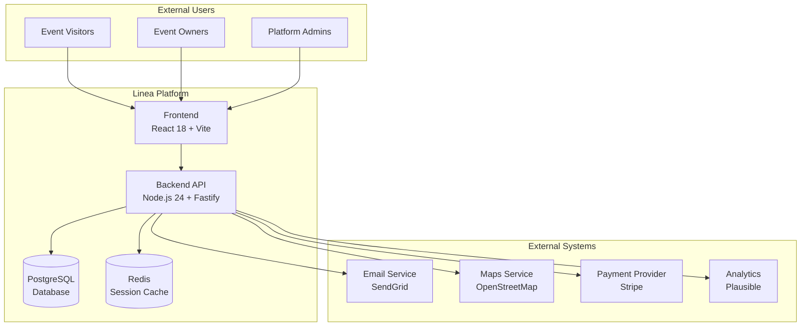
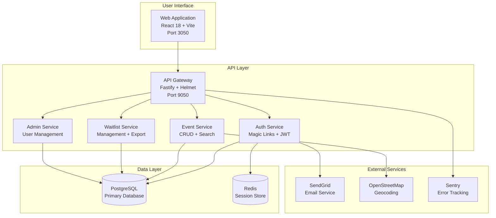
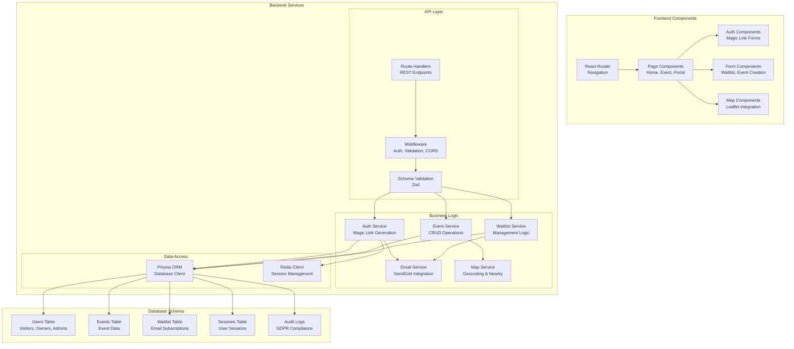

# Linea System Architecture

## C4 Level 1: System Context Diagram

## C4 Level 2: Container Diagram

## C4 Level 3: Component Diagram

## Technology Stack

### Frontend

- **React 18**: Modern UI library with hooks and concurrent features
- **Vite**: Fast build tool and development server
- **TypeScript**: Type-safe JavaScript
- **Tailwind CSS**: Utility-first CSS framework
- **React Router**: Client-side routing
- **React Query**: Server state management
- **Leaflet**: Interactive maps

### Backend

- **Node.js 24**: Latest LTS runtime
- **Fastify**: High-performance web framework
- **TypeScript**: Type-safe development
- **Prisma**: Modern ORM with type safety
- **Redis**: In-memory data store for sessions
- **Zod**: Schema validation
- **Pino**: Fast JSON logger

### Database

- **PostgreSQL 15**: Primary relational database
- **Redis 7**: Session storage and caching

### Infrastructure

- **Railway**: Cloud platform for deployment
- **Docker**: Containerization
- **GitHub Actions**: CI/CD pipeline

### External Services

- **SendGrid**: Email delivery service
- **OpenStreetMap**: Free map tiles and geocoding
- **Sentry**: Error tracking and monitoring
- **Plausible**: Privacy-friendly analytics

## Security Architecture

### Authentication

- **Magic Links**: Passwordless authentication via email
- **JWT Tokens**: Stateless session management
- **Redis Sessions**: Secure session storage
- **Double Opt-in**: GDPR-compliant email verification

### Data Protection

- **HTTPS Everywhere**: All communications encrypted
- **Helmet.js**: Security headers
- **Rate Limiting**: API abuse prevention
- **Input Validation**: Zod schema validation
- **SQL Injection Prevention**: Prisma ORM protection

### Privacy Compliance

- **GDPR Compliance**: Data subject rights implementation
- **Audit Logging**: Complete action tracking
- **Data Retention**: Configurable retention policies
- **Consent Management**: Granular consent tracking

## Performance Considerations

### Frontend Optimization

- **Code Splitting**: Lazy loading of components
- **Image Optimization**: WebP format with fallbacks
- **Caching**: Service worker for offline support
- **Bundle Size**: Tree shaking and minification

### Backend Optimization

- **Database Indexing**: Optimized queries
- **Redis Caching**: Session and data caching
- **Connection Pooling**: Efficient database connections
- **Compression**: Gzip compression for responses

### Monitoring & Observability

- **Health Checks**: Application health monitoring
- **Error Tracking**: Sentry integration
- **Performance Metrics**: Response time tracking
- **Log Aggregation**: Structured logging with Pino

## Deployment Architecture

### Railway Deployment

- **Automatic Deployments**: Git-based CI/CD
- **Environment Variables**: Secure configuration
- **Health Checks**: Automated health monitoring
- **Scaling**: Automatic horizontal scaling

### Database Management

- **Migrations**: Prisma migration system
- **Backups**: Automated database backups
- **Monitoring**: Database performance tracking
- **Connection Pooling**: Efficient connection management
